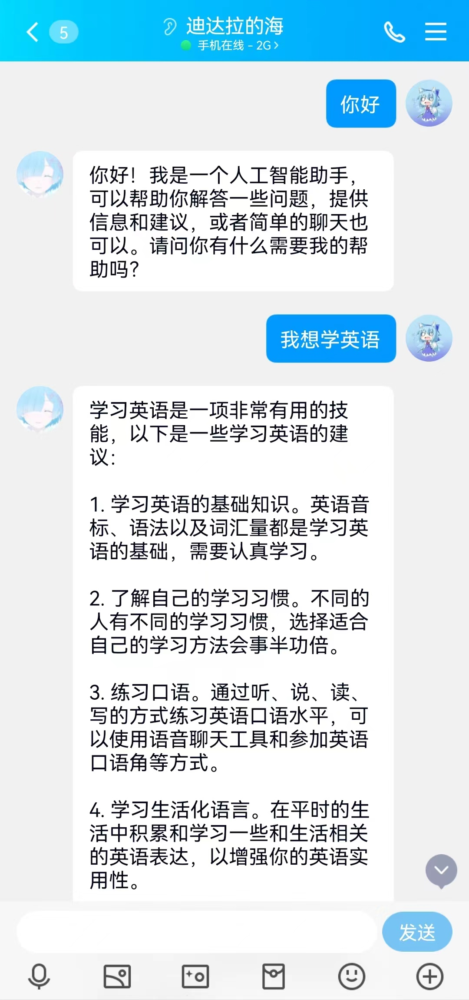

# QQ-ChatBot based on ChatGPT & ChatGLM
    这是一个用于构建QQ版ChatGPT的项目，当前项目需要使用你的openai账号生成APIKEY，以及一点点魔法，简单实现QQ自动抓取信息，以及用Chat机器人回复的小程序。

# 配置go-cqhttp
详细教程见[go-cqhttp教程](https://docs.go-cqhttp.org/guide/quick_start.html#%E5%9F%BA%E7%A1%80%E6%95%99%E7%A8%8B)
- 进入go-cqhttp文件夹，打开config.yml，在第4行配置好QQ账号后退出（也可以用账号密码的方式登录，请参考官网）
- config.yml中104行的url: 'http://127.0.0.1:8080' 为本项目的server地址，如果更改过flask的host或port，请同时修改此处
- 点击go-cqhttp.bat，完成扫码登录等操作后退出

# 配置项目
    如果在国内运行，需要开启VPN，VPN的端口配置在ChatGPT_chat_demo.py的9、10行中

# 运行项目
- python server.py 运行项目即可
- 项目listener会自动启动和监听go-cqhttp程序，若长时间未收到会重启

# 运行截图

